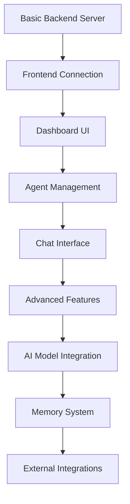

# 🎯 reVoAgent Implementation Plan - Get Working in 30 Minutes

## 📋 **Phase 1: Basic Setup (5 minutes)**

### **Step 1: Run Quick Start Script**
```bash
# Save the quick start script as 'quick_setup.sh' and run:
chmod +x quick_setup.sh
./quick_setup.sh
```

This will:
- ✅ Check requirements (Python 3.9+, Node 18+)
- ✅ Create proper environment files
- ✅ Create simplified backend server
- ✅ Install dependencies
- ✅ Set up startup scripts

---

## 🖥️ **Phase 2: Backend Setup (10 minutes)**

### **Step 2: Start Simplified Backend**
```bash
# Use the simplified backend (no complex AI dependencies)
python3 simple_dev_server.py
```

### **Step 3: Verify Backend**
```bash
# Test backend endpoints
curl http://localhost:8000/health
curl http://localhost:8000/api/dashboard/stats
curl http://localhost:8000/api/agents
```

**Expected Output:**
```json
{
  "status": "healthy",
  "timestamp": "2024-01-01T12:00:00",
  "version": "1.0.0-dev"
}
```

---

## 🎨 **Phase 3: Frontend Setup (10 minutes)**

### **Step 4: Fix Frontend Configuration**
```bash
# Run environment config fix
chmod +x environment_config_fix.sh
./environment_config_fix.sh
```

### **Step 5: Start Frontend**
```bash
cd frontend
npm install
npm run dev
```

### **Step 6: Verify Frontend Connection**
- Open browser to `http://localhost:12000`
- Check for "🟢 Connected" status in top-right corner
- Verify no red errors in browser console (F12)

---

## 🔧 **Phase 4: Integration Testing (5 minutes)**

### **Step 7: Test Full Stack**
```bash
# Test API endpoints from frontend
# Open browser dev tools (F12) and run:
fetch('/api/health').then(r => r.json()).then(console.log)
fetch('/api/dashboard/stats').then(r => r.json()).then(console.log)
```

### **Step 8: Test WebSocket**
```bash
# Test WebSocket connection
# In browser console:
const ws = new WebSocket('ws://localhost:8000/ws/chat');
ws.onopen = () => console.log('WebSocket connected!');
ws.onmessage = (msg) => console.log('Received:', JSON.parse(msg.data));
ws.send(JSON.stringify({content: 'Hello from frontend!'}));
```

---

## 🚀 **Phase 5: Feature Implementation (Progressive)**

### **Priority 1: Core Dashboard (Week 1)**
```bash
# Implement basic components:
# 1. Dashboard with system stats
# 2. Agent status display
# 3. Basic navigation
# 4. Health monitoring
```

**Files to focus on:**
- `frontend/src/components/Dashboard.tsx`
- `frontend/src/components/EnhancedDashboard.tsx`
- `frontend/src/services/api.ts` (use the fixed version)

### **Priority 2: Agent Management (Week 2)**
```bash
# Implement agent features:
# 1. Agent status monitoring
# 2. Basic agent execution
# 3. Task management
# 4. Agent history
```

**Implementation approach:**
1. Start with mock data
2. Implement UI components
3. Add real API integration
4. Test thoroughly

### **Priority 3: Advanced Features (Week 3+)**
```bash
# Add advanced features:
# 1. Real AI model integration
# 2. Memory/database features
# 3. External integrations
# 4. Production deployment
```

---

## 🎯 **Implementation Strategy**

### **Development Approach: Bottom-Up**

1. **Foundation First**: Get basic app structure working
2. **Mock Everything**: Use mock data for rapid development
3. **Incremental Enhancement**: Add real features one by one
4. **Test Continuously**: Verify each component works before moving on

### **Component Implementation Order**



---

## 📁 **File Structure to Focus On**

### **Backend (Priority Files):**
```
simple_dev_server.py          # ← START HERE (working backend)
apps/backend/main.py          # ← Complex version (implement later)
packages/ai/                  # ← AI features (Week 3+)
packages/agents/              # ← Agent logic (Week 2)
```

### **Frontend (Priority Files):**
```
frontend/src/
├── App.tsx                   # ← Main app structure
├── services/
│   └── api.ts               # ← API communication (use fixed version)
├── components/
│   ├── Dashboard.tsx        # ← Week 1 priority
│   ├── AgentManagement.tsx  # ← Week 2 priority
│   └── ...                  # ← Other components (Week 3+)
```

---

## 🔄 **Development Workflow**

### **Daily Development Cycle:**

1. **Morning Setup** (5 min):
   ```bash
   ./start_revoagent_dev.sh
   # Verify both services are running
   ```

2. **Development** (Work session):
   - Make changes to code
   - Test in browser
   - Check logs for errors
   - Commit working changes

3. **Testing** (10 min):
   ```bash
   # Test backend
   curl http://localhost:8000/health
   
   # Test frontend
   # Open http://localhost:12000 and verify functionality
   ```

4. **End of Day**:
   ```bash
   ./stop_revoagent_dev.sh
   git add .
   git commit -m "Working: [describe what works]"
   ```

---

## ⚠️ **Common Pitfalls to Avoid**

### **Don't Do This:**
- ❌ Try to implement all AI features at once
- ❌ Start with complex backend before basic one works
- ❌ Add database integration before UI works
- ❌ Deploy to production before development works

### **Do This Instead:**
- ✅ Start with simplified backend and basic UI
- ✅ Use mock data for rapid development
- ✅ Test each component thoroughly
- ✅ Add complexity incrementally

---

## 📊 **Success Metrics**

### **Week 1 Goals:**
- [ ] Backend and frontend connecting successfully
- [ ] Basic dashboard displaying mock data
- [ ] Navigation between sections working
- [ ] No console errors in browser
- [ ] Health checks passing

### **Week 2 Goals:**
- [ ] Agent management interface working
- [ ] Basic chat functionality implemented
- [ ] Real API endpoints returning data
- [ ] WebSocket communication working

### **Week 3+ Goals:**
- [ ] AI model integration working
- [ ] Database/memory features implemented
- [ ] External integrations functional
- [ ] Production deployment ready

---

## 🆘 **If You Get Stuck**

### **Emergency Recovery:**
```bash
# Complete reset
./stop_revoagent_dev.sh
rm -rf logs/ frontend/node_modules/
git clean -fd
git reset --hard

# Fresh start
./quick_setup.sh
./start_revoagent_dev.sh
```

### **Debug Steps:**
1. Check logs: `tail -f logs/backend.log`
2. Test backend: `curl http://localhost:8000/health`
3. Check browser console for frontend errors
4. Verify ports: `lsof -i :8000` and `lsof -i :12000`
5. Use troubleshooting guide

---

## 🎉 **Final Goal**

By following this plan, you'll have:

- ✅ **Working full-stack application** (basic version)
- ✅ **Proper development environment** set up
- ✅ **Clear path forward** for adding features
- ✅ **Debugging skills** for when issues arise
- ✅ **Foundation** for advanced AI features

**Success looks like:** Opening `http://localhost:12000` and seeing a working dashboard with real-time connection to your backend, no errors in the console, and the ability to navigate between different sections of your application.

Let's get your reVoAgent platform running! 🚀